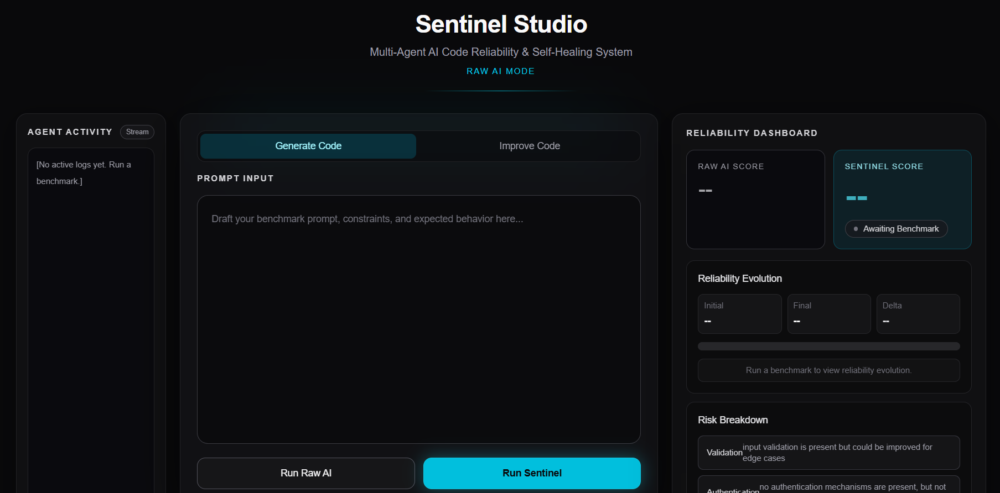
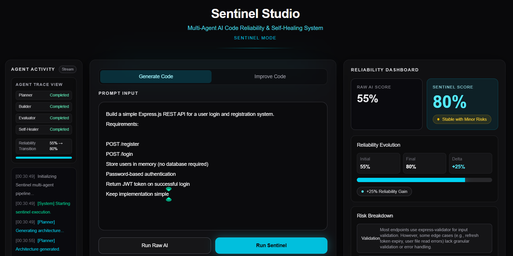

# 🛡️ Sentinel Studio

### A Reliability Control Layer for AI‑Generated Backend Code  
**Multi‑Agent System built with OpenAI Codex**

---

## 🌐 Live Application

**Deployed (No Login Required)**  
https://sentinel-studio-sigma.vercel.app/ 

**GitHub Repository**  
https://github.com/DOM-ABDUL/sentinel-studio  

---

## The Problem

AI can generate backend systems in seconds.

But generation is not verification.

AI‑produced backend code often includes:

- Hardcoded secrets  
- Missing input validation  
- Weak authentication logic  
- Incomplete error handling  
- Hallucinated or insecure dependencies  

The output may compile.  
It may even look correct.  

But it has not been systematically evaluated.

There is no reliability control layer between generation and deployment.

---

## The Idea

Sentinel Studio introduces that missing layer.

Instead of trusting a single response, it runs each request through a structured multi‑agent workflow that:

1. Plans the architecture  
2. Generates the implementation  
3. Audits and scores reliability  
4. Automatically refactors vulnerabilities  
5. Re‑evaluates before returning final output  

The goal is simple:

Move from **“AI generated this”**  
to  
**“AI generated, evaluated, and improved this.”**

---

## Screenshot — Main Interface





---

## How It Works

Sentinel Studio uses OpenAI Codex in a structured agent pipeline.

###  Planner Agent
Analyzes the request and defines:
- Architecture
- Required middleware
- Security baselines
- Edge cases

###  Builder Agent
Implements backend logic according to the plan.

###  Evaluator Agent
Performs structured static analysis and returns:
- Reliability score (0–100)
- Category breakdown:
  - Validation
  - Authentication
  - Secret handling
  - Error handling

### Self‑Healer Agent
If the score falls below 85:
- Consumes the evaluator’s findings  
- Refactors vulnerable sections  
- Re‑runs evaluation before final output  

This demonstrates true agentic behavior:
- Explicit role separation  
- Multi-step reasoning  
- Structured JSON outputs  
- Conditional re‑execution  
- Review loop enforcement  

---

##  Screenshot — Reliability Surge





---

## Modes

### Raw Mode
Simulates a standard single‑pass AI generator.  
One response. One evaluation.

Provides a baseline reliability score.

### Sentinel Mode
Runs the full multi‑agent pipeline.  
Planning → Building → Auditing → Healing → Final Score.

The reliability delta makes the improvement measurable.

---


## Improve Existing Code

Sentinel Studio can also audit user‑provided backend code.

It returns:
- Structured vulnerability report  
- Hardened refactored version  
- Plain‑language explanation of changes  

This makes it usable beyond generation — as a lightweight reliability assistant.

---

## Architecture

Clear separation of concerns:

```
app/
 ├── page.tsx                → UI layer
 ├── api/run-agents/route.ts → Orchestration layer
lib/
 └── agents.ts               → Codex agent logic
```

### Stack

- Next.js (App Router)  
- React + TypeScript  
- Tailwind CSS  
- OpenAI SDK (Codex via gpt-4o-mini)  
- Vercel deployment  

The agent system is isolated from presentation logic to keep orchestration predictable and testable.

---

## Codex Usage

Codex is used as a reasoning engine, not a text generator.

It performs:

- Prompt decomposition and planning  
- Structured backend generation  
- Static reliability evaluation  
- JSON‑validated reporting  
- Conditional iterative correction  

Every stage produces structured outputs before advancing to the next.

---

## Local Development

```bash
git clone https://github.com/DOM-ABDUL/sentinel-studio.git
cd sentinel-studio
npm install
```

Create `.env`:

```env
OPENAI_API_KEY=your_key_here
```

Run:

```bash
npm run dev
```

Visit:

http://localhost:3000

---

## Why It Matters

As AI coding tools become default infrastructure, the risk is no longer slow development.

The risk is silent failure.

Sentinel Studio focuses on reliability before trust.

---

## Future Work

- Inline Git-style diff viewer  
- Sandboxed runtime testing  
- CI/CD gating by reliability score  
- GitHub PR integration  

---

## Final Statement

AI can write code.

Sentinel Studio asks a more important question:

**Should that code be trusted yet?**

